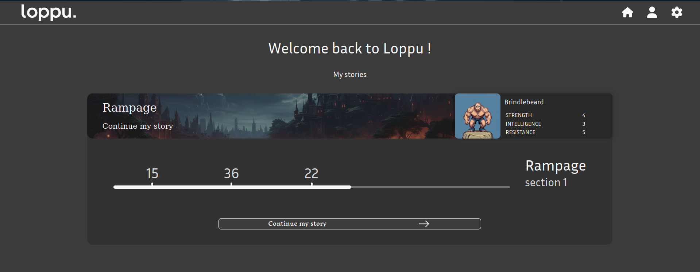

# User guide to Loppu, Cayden Quest project website

When you first open the website, you will be greeted with a landing page which will give you a brief overview of the different stories you can play, along with the character you chose for each of them. You can click on a story to see your progress, the last 3 choices you made and the section you were at. To continue playing, click on the corresponding story then button.

After arriving at the story page, you will be presented with the section you were at, with the text and choices you can make. Each choice will take you to the next section until you reach the end of the story. You can still see the last 3 choices you made along with you character stats and inventory (click on the character to see more).

At any time you can access your account and settings by clicking on the upper right corner of the screen the corresponding buttons. You can also go back to the home page by clicking on the logo or house icon.

If you see this loading screen, it means the website is fetching the data from the server. Please wait a few seconds for the data to load. If the loading screen persists, please check your internet connection or contact the support.

